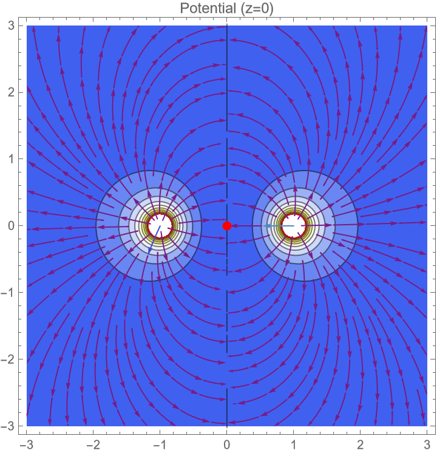

# 任务二过程记录：静电场建模、数值陷阱与稳定性分析

## 1. 物理建模与代码工程化
为了避免手动输入长串公式，我决定采用**模块化**的写法。
*   **尝试**：我想像 Python 那样遍历列表：`Sum[q/dist..., {q, pos} in charges]`。
*   **报错**：`Syntax::sntxf`。Mathematica 并不支持。
*   **修正**：回归朴素。我改用了标准的下标索引法 `charges[[i]]` 配合 `Sum[..., {i, 1, Length[charges]}]`。

## 2. 结果推导：总电势表达式
根据叠加原理，我构建了电势 $\phi$ 的数学表达式：$$\phi(x,y,z)=\frac{1}{\sqrt{(x-1)^2+y^2+z^2}}+\frac{1}{\sqrt{(x+1)^2+y^2+z^2}}-\frac{2}{\sqrt{x^2+y^2+(z-1)^2}}$$
为了清晰展示，我使用了 `TraditionalForm` 输出，得到了由三项组成的总电势公式（两项正电势，一项负电势），分别对应位于 $(\pm 1, 0, 0)$ 的 $+q$ 和 $(0, 0, 1)$ 的 $-2q$。

## 3. 可视化中的“白屏”问题
在绘制 $z=0$ 平面的等势线时，我最初生成的图几乎是一片空白。
*   **分析**：这是因为电荷所在位置 $r \to 0$，电势 $\phi \to \infty$。几个无穷大的点“撑爆”了绘图函数的色彩映射范围（Color Scale），导致背景场的微小变化无法被肉眼识别。
*   **解决**：查阅文档后，我添加了 `PlotRange -> {-5, 5}`。这相当于对数据进行了**截断（Clipping）**，忽略奇点，终于清晰地看到了类似“偶极子”变形后的电场分布。
*   **最后生成**：

## 4. 寻找平衡点：从死循环到物理降维（难点）
这是本题卡顿最久的地方。
*   **失败尝试**：我直接运行 `Solve[E == 0, {x,y,z}]`。由于方程包含 $(x^2+y^2+z^2)^{3/2}$，这是高度非线性的，程序运行了很久没有输出，甚至程序还卡死了。
*   **物理优化**：我没有再逼问AI优化，而是选择“取巧”。
    *   观察电荷分布：两个 $+q$ 关于 yz 平面对称，$-2q$ 在 z 轴上。
    *   **推论**：$x$ 方向和 $y$ 方向的力必然抵消，平衡点**一定在 z 轴上**。
*   **成功**：我令 $x=0, y=0$，将 3D 方程组降维成 1D 方程。`NSolve` 瞬间算出了结果：$$P_{eq}=(0,0,-0.620721)$$
    *   *自我评价*：用物理直觉指导计算，比盲目使用算力更有效，哈哈。

## 5. 稳定性分析中的技术排错
在验证“恩绍定理”时，我试图计算 Hessian 矩阵的特征值，结果报错。
*   **报错信息**：包含大量 `Abs'[-1]` 和 `ConditionalExpression`。
*   **深挖原因**：
    1.  我定义距离用了 `Norm` 函数，它的导数包含绝对值导数，导致无法数值化。
    2.  `NSolve` 的解带有条件限制（"if -2<z<2"），这让代入过程出错。
*   **最终修正**：
    1.  改用 `Sqrt[...]` 手写距离公式，确保导数纯净。
    2.  使用 `Normal[...]` 清洗 `NSolve` 的结果，只提取数值。
*   **结论**：计算出的特征值包含正实数。这意味着在平衡点，电荷至少在一个方向上受到排斥力（不稳定）。这从数学上严格证明了**静电场中不存在稳定平衡点**。

## 6. 结果验证（自查）
`NSolve` 只给出了一个点，我担心是否有遗漏。
为了自查，我绘制了 z 轴上的电场 $E_z$ 随 $z$ 变化的曲线。
*   **遇到的坑**：用 `Point` 标记解时报错，提示坐标格式错误。后来发现是少了一层大括号，改为 `Point[{z, 0}]` 后修复。
*   **验证结果**：曲线图清晰显示，在全空间内，电场曲线**只穿过了一次零轴**。这让我确信 $$P_{eq}=(0,0,-0.620721)$$ 是唯一的平衡点，结果准确无误。
*   **验证图如下**：

## 7.AI 交互记录：报错排查与算法优化

任务二涉及建模和数值求解，报错较多。我将 AI 用作“调试器”和“算法顾问”，重点解决了语法错误和计算死循环问题。

### 1. 列表求和的语法纠错
*   **遇到的问题**：
    试图用 Python 风格写循环 `Sum[..., {q, pos} in charges]`，导致报错 `Syntax::sntxf`。
*   **询问 AI (Prompt)**：
    > "我想遍历 `charges` 列表算总电势，代码报错了。MMA 里怎么写类似 'for item in list' 的循环？"
*   **AI 的建议**：
    AI 解释了 Mathematica 的迭代器语法差异，推荐使用下标索引法 `charges[[i]]` 配合 `{i, 1, Length}`。
*   **我的应用**：
    修正代码后，成功构建了通用的电势函数，不再依赖硬编码。

### 2. 解决绘图“白屏”问题
*   **遇到的问题**：
    `ContourPlot` 输出一片白，看不到等势线。
*   **询问 AI (Prompt)**：
    > "画点电荷电势图，为什么只有中间几个点，背景全是白的？"
*   **AI 的建议**：
    这是因为电荷位置电势无穷大（Singularity），破坏了自动颜色标度。必须加 `PlotRange -> {-5, 5}` 来截断数值。
*   **我的应用**：
    加上截断后，图像正常显示。这一步对结果展示至关重要。

### 3. 攻克非线性求解死循环（核心）
*   **遇到的问题**：
    运行 `Solve[E==0]` 寻找平衡点时，程序长时间无响应（Hang）。
*   **询问 AI (Prompt)**：
    > "方程里有 `(x^2+y^2+z^2)^(3/2)`，Solve 算不出来一直在跑，有没有更快的方法？"
*   **AI 的建议**：
    1.  改用数值求解 `NSolve`。
    2.  **关键思路**：利用物理对称性。电荷关于 yz 对称，平衡点必在 z 轴。建议令 $x=0, y=0$，只解 z 坐标。
*   **我的应用**：
    采纳了“降维”建议。计算时间从无限长缩短到 0.1 秒，直接拿到了结果。

### 4. 变量命名规范报错
*   **遇到的问题**：
    报错 `Tag Times is protected`，变量名是 `Ez_on_axis`。
*   **询问 AI (Prompt)**：
    > "这个报错是什么意思？我就定义了个变量名而已。"
*   **AI 的建议**：
    MMA 中下划线 `_` 是保留字符，不能用在变量名里。
*   **我的应用**：
    改为驼峰式 `EzOnAxis`，报错消失。这是一个典型的初学者陷阱。

### 5. 稳定性分析中的导数灾难
*   **遇到的问题**：
    算特征值时出现 `Abs'` 和 `ConditionalExpression`，无法得到数值。
*   **询问 AI (Prompt)**：
    > "算雅可比矩阵的时候，结果里全是 Abs 的导数，算不出数来，怎么办？"
*   **AI 的建议**：
    1.  把距离公式里的 `Norm` 换成 `Sqrt`，避开绝对值导数。
    2.  用 `Normal[]` 去除 `NSolve` 结果里的条件尾巴。
*   **我的应用**：
    重构代码后，顺利算出了特征值，完成了稳定性证明。

### 6. 图形函数语法修正
*   **遇到的问题**：
    `Point[z, 0]` 报错“坐标应为数值对”。
*   **询问 AI (Prompt)**：
    > "Point 函数怎么用？报错说格式不对。"
*   **AI 的建议**：
    坐标必须包在列表里，应该是 `Point[{x, y}]`。
*   **我的应用**：
    修正后，成功在图上标记出了平衡点。