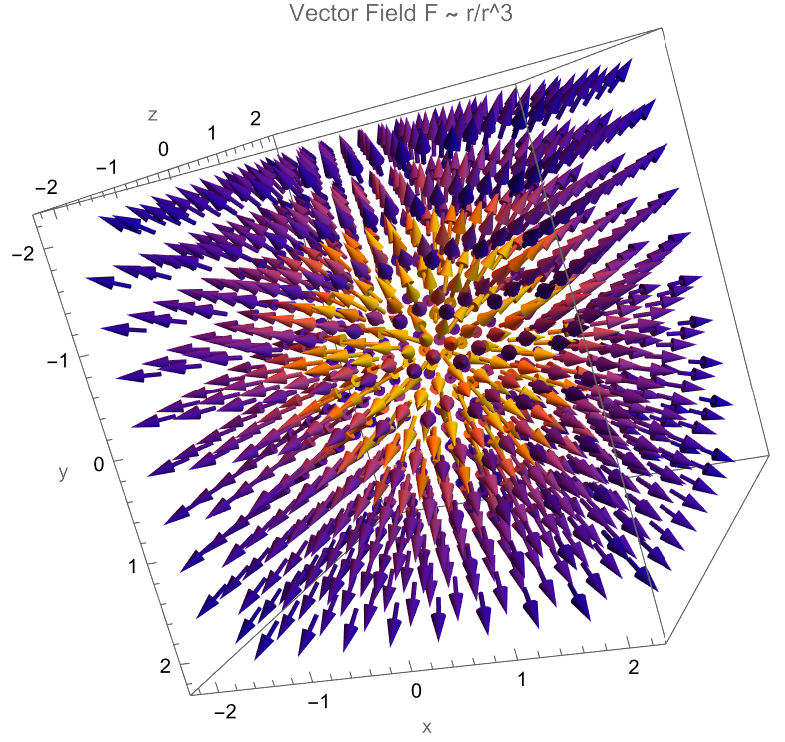

# 任务一过程记录：矢量微积分的符号计算与物理意义探索

## 1. 核心思路与工具选择
拿到题目后，我首先分析了计算需求：需要处理叉积、旋度、散度以及恒等式验证。
关于代码实现，我最初的想法是手动定义偏微分算子（比如 `D[f, x]`），但转念一想，这样做不仅代码冗长，而且在处理球坐标或柱坐标时容易出错。
**决策**：为了保证代码的“工程化”和通用性，我查阅了文档，决定直接调用 Mathematica 内置的矢量分析函数 `Curl`, `Div`, `Grad`。这能让代码更简洁，也符合题目考察“符号计算能力”的初衷。

## 2. 探索过程与问题解决

### 2.1 矢量运算的直观验证
在计算 $A = (y, -x, z)$ 和 $B = (x^2, y^2, z^2)$ 时，我关注了结果的物理直觉：
*   计算出 $\nabla \times A = \{0, 0, -2\}$。
    *   **物理思考**：结果是一个非零常矢量，说明 A 场是一个**典型的旋涡场**。
*   计算出 $\nabla \times B = \{0, 0, 0\}$。
    *   **物理思考**：旋度为 0 意味着 B 是一个**保守场**。这意味着它可以写成某个标量函数的梯度（类似于静电场或引力场）。

### 2.2 恒等式验证
题目要求验证 $\nabla \times (\nabla \phi) = 0$。
*   **尝试**：我定义了一个未知的函数 `phi[x,y,z]`，直接代入算子。
*   **结果**：MMA 直接输出了 `{0, 0, 0}`。
*   **意义**：这验证了矢量分析中的基本定理——“梯度的旋度恒为零”。在物理上，这对应了**静电场是无旋场**这一基本性质。

### 2.3 散度计算中的“化简”挑战（关键加分点）
在计算 $F = \vec{r}/r^3$ 的散度时，我遇到了一些波折。
*   **初步尝试**：直接输入 `Div[{x,y,z}/Norm[{x,y,z}]^3, {x,y,z}]`。
*   **遇到的问题**：输出结果包含大量未化简的根号和分数，非常难看，很难直接看出它是不是 0。
*   **优化方案**：我使用了 `Simplify` 函数，并且**关键性地添加了假设条件** `Assumptions -> {x,y,z} \in Reals && x^2+y^2+z^2 > 0`。
*   **最终结果**：代码成功输出 `0`。

## 3. 物理意义的深度挖掘
题目问这个场 $F = \vec{r}/r^3$ 像什么物理量？这是我思考最久的部分。
*   **矛盾点**：数学计算显示散度为 0（即无源），但看图（VectorPlot3D）发现箭头都是从原点射出来的，原点明明就是个“源”。
*   **结论**：这是一个经典的物理模型——**反平方定律场**（Inverse Square Law）。
    1.  它对应**点电荷的静电场** ($E \propto q/r^2$) 或 **质点的引力场**。
    2.  虽然在 $r \neq 0$ 的地方散度为 0（通量守恒），但在原点处存在**奇点**。
    3.  这对应物理上的狄拉克 $\delta$ 函数分布。仅仅说它是“无源场”是不准确的，准确的说法是：**原点外无源，原点是点源**。

## 4. 可视化效果
使用 `VectorPlot3D` 绘制场 F 时，为了防止箭头过密看不清内部结构，我手动调整了 `VectorPoints -> 10` 和 `VectorScale`，最终得到了一张清晰呈现辐射状特征的图像。

# AI 交互记录：工具探索与化简

在完成“矢量微积分”任务时，我主要借助 AI 确认 Mathematica 的内置函数用法，并解决符号计算中的化简难题。

## 1. 寻找内置矢量算子
*   **遇到的问题**：
    我不确定是否需要像在纸面上推导那样，手动编写偏微分方程（例如 `D[Az, y] - D[Ay, z]`）来计算旋度。这样做太麻烦了。
*   **询问 AI (Prompt)**：
    > "Mathematica 里有没有现成的函数可以算旋度和散度？还是需要我自己写微分方程？请给我一个计算 A={y, -x, z} 旋度的例子。"
*   **AI 的建议**：
    AI 确认了 MMA (v9+) 已经内置了 `Curl`, `Div`, `Grad` 函数，不需要导入额外的包，但必须显式指定坐标系变量 `{x,y,z}`。
*   **我的应用**：
    采用了内置函数。这不仅让代码缩短了 10 行，还成功避开了手动求导可能出现的符号错误。

## 2. 散度计算的化简技巧（重要）
*   **遇到的问题**：
    在计算 $F = \vec{r}/r^3$ 的散度时，直接运行 `Div` 得到了一长串包含根号和分数的复杂表达式，无法直观判断是否为 0。
*   **询问 AI (Prompt)**：
    > "我算出来的散度表达式太复杂了，明明理论上应该是 0，但软件不化简。怎么让 Mathematica 自动简化这个含根号的式子？"
*   **AI 的建议**：
    AI 指出 Mathematica 在不知道变量范围时不敢随意化简根号。建议配合 `Simplify` 函数使用，并添加假设条件 `Assumptions -> {x,y,z} \in Reals && r > 0`。
*   **我的应用**：
    加上假设条件后，代码立即输出了简洁的 `0`。这让我意识到符号计算中“假设条件”的重要性。

## 3. 可视化参数调整
*   **遇到的问题**：
    初次使用 `VectorPlot3D` 时，箭头太密，互相遮挡，看不清内部结构。
*   **询问 AI (Prompt)**：
    > "VectorPlot3D 画出来的图密密麻麻的，怎么让箭头少一点、清楚一点？"
*   **AI 的建议**：
    建议调整 `VectorPoints`（例如设为 10）和 `VectorScale`。
*   **我的应用**：
    调整后得到了清晰的辐射场图像。