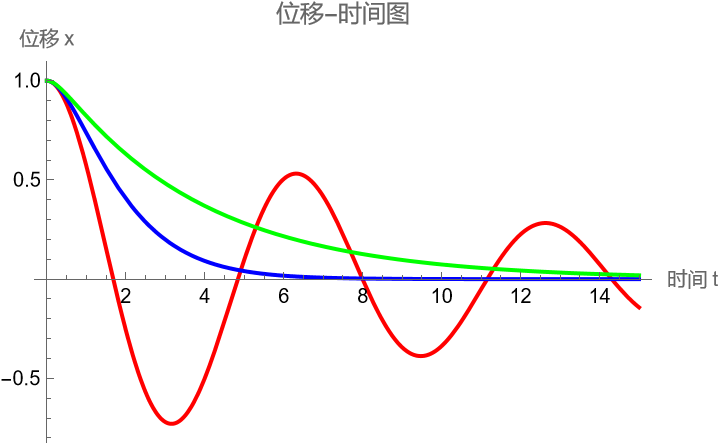

# 任务一过程记录：阻尼振动求解与相图绘制中的数值陷阱

## 1. 代码架构：从复制粘贴到模块化
拿到题目 $m\ddot{x}+\gamma\dot{x}+kx=0$，需要处理三种不同阻尼系数（$\gamma=0.2, 2, 4$）。
*   **初期尝试**：我最初打算写三遍 `DSolve`，分别代入参数。
*   **反思**：这样做不仅代码冗长，而且严重违反了题目中“工程化能力”的要求。如果后续要修改初始条件 $x(0)$，我得改三个地方，极易出错。
*   **优化**：我参考函数式编程思路，定义了一个辅助模块 `solveCase[gVal_]`。利用 `Module` 封装局部变量，这样主程序非常干净，只需要调用三次函数即可，实现了参数与逻辑的解耦。

## 2. 解析解的数据结构坑
在使用 `DSolve` 时，我遇到了绘图报错。
*   **尝试**：直接运行 `sol = DSolve[eqn, x[t], t]`，然后 `Plot[sol, ...]`。
*   **报错**：Plot 输出空白。
*   **分析**：`DSolve` 返回的是规则列表 `{{x[t] -> ...}}`，这是一种替换规则而非数学表达式。`Plot` 无法直接读取规则。
*   **修正**：我改用了 `DSolveValue`。查阅文档发现这个函数可以直接返回 $x(t)$ 的数学表达式，省去了用 `/.` (ReplaceAll) 提取的繁琐步骤。

## 3. 相图绘制中的“求值顺序”报错（核心难点）
这是本题卡顿最久的地方。在绘制 $(x, \dot{x})$ 轨迹时，程序报了红。
*   **代码**：`ParametricPlot[{sol, D[sol, t]}, {t, 0, 15}]`
*   **报错信息**：`D: 0.000306... is not a valid variable.`
*   **深挖原因**：
    1.  我原本以为 Mathematica 会像数学推导一样，先算出导数表达式，再代入数值。
    2.  实际上 `ParametricPlot` 的执行逻辑是：**先数值化，再计算**。它先把 $t$ 赋值为 0.000306...，然后试图计算 `D[sol, 0.000306...]`。对常数求导在语法上是不成立的。
*   **最终修正**：
    采用了**“预计算”策略**。我在绘图前，先在外面算好了速度表达式 `v = D[sol, t]`，确认它是一个关于 $t$ 的函数，再把 `v` 传进绘图函数。问题解决。

**修正后的相空间轨迹图：**

*(图注：横轴为位移 $x$，纵轴为速度 $\dot{x}$。红色曲线（欠阻尼）呈现螺旋状向原点收敛。这直观地展示了系统总能量 $E = \frac{1}{2}mv^2 + \frac{1}{2}kx^2$ 随时间逐渐耗散的过程。)*

## 4. 物理结果验证与深度分析
代码运行后，我检查了三条曲线的物理形态，并结合理论公式 $\gamma_{crit} = 2\sqrt{mk} = 2$ 进行了验证：

**三种阻尼情况对比图：**

*(图注：红色-欠阻尼（震荡）；蓝色-临界阻尼（最快归零）；绿色-过阻尼（缓慢归零）。结果完全符合物理预期。)*

*   **欠阻尼 ($\gamma=0.2 < 2$)**：
    *   **现象**：图像呈现明显的震荡衰减。
    *   **物理意义**：阻尼力不足以抵消弹性回复力，物体在平衡位置附近来回摆动，振幅按 $e^{-\gamma t/2}$ 指数衰减。
*   **临界阻尼 ($\gamma=2$)**：
    *   **现象**：物体以最快速度回到平衡位置且不发生震荡。
    *   **工程意义**：这是系统从震荡到不震荡的临界点。在工程设计（如汽车避震、指针式仪表）中，这通常是**最优设计点**——既能快速稳定，又不会产生恼人的晃动。
*   **过阻尼 ($\gamma=4 > 2$)**：
    *   **现象**：图像没有震荡，直接缓慢回零，像陷在蜂蜜里。
    *   **物理意义**：阻力过大，主导了运动过程，使得物体回到平衡位置所需的时间大大增加（弛豫时间变长）。

## 5. AI 交互记录：报错排查与工具使用

本题中我主要利用 AI 解决具体的语法报错和绘图设置问题。

### 1. 解决 ParametricPlot 报错
*   **遇到的问题**：
    绘图时出现 `D: ... not a valid variable`，无法生成相图。
*   **询问 AI (Prompt)**：
    > "ParametricPlot 里包含 D[sol, t]，报错说 t 是数字不是变量，这是什么原因？"
*   **AI 的建议**：
    这是 Evaluation Order（求值顺序）问题。绘图函数优先代入数值。建议在 Plot 外部先计算好导数表达式。
*   **我的应用**：
    采纳建议，把 `v = D[sol, t]` 提到了 Plot 外面，成功修复 bug。

### 2. 自动化图例设置
*   **遇到的问题**：
    三条线混在一起，手动加标签太繁琐。
*   **询问 AI (Prompt)**：
    > "Mathematica 画图怎么自动加图例？我有三组数据。"
*   **AI 的建议**：
    使用 `PlotLegends` 选项，可以直接传入列表 `{"欠阻尼", ...}`。
*   **我的应用**：
    加上该选项后，图像自动生成了带颜色的图例，满足了“文档与展示”的要求。