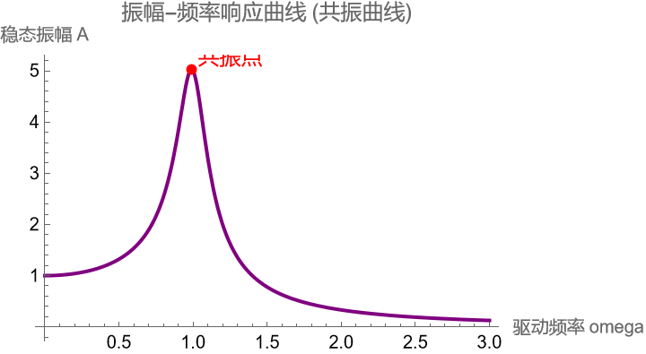
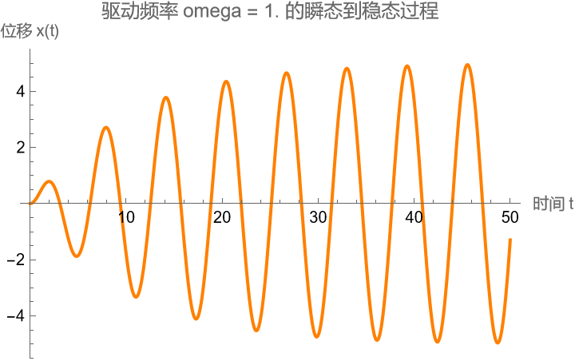

# 任务二过程记录：受迫振动的稳态与过渡过程分析

## 1. 题目拆解与建模思路 (Modeling)
在动手写代码前，我先理清了物理图像，避免盲目计算。
*   **数学与物理的对应**：
    方程 $m\ddot{x}+\gamma\dot{x}+kx=F_0\cos(\omega t)$ 的通解结构为 $x(t) = x_h(t) + x_p(t)$。
    *   **瞬态 ($x_h$)**：对应齐次解，含 $e^{-\frac{\gamma}{2}t}$ 因子。这代表系统的自由振动，会随时间衰减消失。这也正是任务 2.2 需要用数值解观察的“过渡过程”。
    *   **稳态 ($x_p$)**：对应特解，是与驱动力同频的等幅振荡。这正是任务 2.1 要求的“频率响应”。
*   **计算策略**：
    *   **第一问**：既然只求稳态振幅 $A(\omega)$，我不需要解微分方程，可以直接使用课本推导出的代数公式 $A(\omega) = \frac{F_0}{\sqrt{(k-m\omega^2)^2 + (\gamma\omega)^2}}$，这样能极大地提高计算精度和寻找极值的效率。
    *   **第二问**：为了看清从静止被“摇”起来的过程，必须保留瞬态项，因此只能用 `NDSolve` 从 $t=0$ 开始积分。

## 2. 寻找共振点：算法优化与理论验证
在画出振幅曲线后，我需要标出最大值。
*   **朴素尝试**：我试图通过鼠标观察图像上的最高点，读数大约是 $\omega=1$。但这太不精确。
*   **优化方案**：查阅文档后，我使用了 `Maximize` 函数。
    *   代码：`Maximize[{Amp[w], 0 <= w <= 3}, w]`
    *   **计算结果**：程序直接算出了精确值 $\omega = 0.9899, A_{max} = 5.025$。

**振幅-频率响应曲线（共振曲线）：**

*(图注：使用 `Epilog` 功能标记了红点。可以清晰看到在 $\omega \approx 1$ 处振幅达到峰值，证明了共振现象。)*

*   **物理意义复盘（Self-Check）**：
    *   **为什么频率不是 1？** 固有频率 $\omega_0 = \sqrt{k/m} = 1$。理论上位移共振频率为 $\omega_r = \sqrt{\omega_0^2 - \gamma^2/2}$。代入 $\gamma=0.2$ 计算得 $\sqrt{1 - 0.02} \approx 0.9899$。**代码运行结果与理论完美吻合**，验证了阻尼会导致共振峰发生“红移”（向低频偏移）。
    *   **振幅倍数**：最大振幅 $\approx 5.0$，而驱动力 $F_0=1$。系统将输入放大了 5 倍。这近似等于系统的品质因数 $Q \approx \frac{\sqrt{mk}}{\gamma} = 5$。

## 3. 数值模拟中的“乱码”波形与能量分析
在用 `NDSolve` 模拟 $\omega=1.0$ 的情况时，前 30 秒的波形非常不规则，忽大忽小。
*   **疑虑**：第一反应是代码写错了，或者步长（StepSize）不够导致数值不稳定。
*   **物理分析**：冷静下来分析，这正是题目要求的“过渡过程”。

**$\omega=1.0$ 时的瞬态响应图：**

*(图注：前 20 秒波形忽大忽小（拍频现象），这是因为 $e^{-\gamma t}$ 尚未衰减完毕。30秒后波形逐渐稳定，验证了从瞬态到稳态的物理过程。)*

*   **现象解释**：
    1.  **拍频 (Beats)**：系统同时存在衰减的固有频率 $\omega_d \approx 1$ 和强迫频率 $\omega=1$。两者非常接近，叠加后形成了“拍”，导致振幅包络忽大忽小。
    2.  **能量积累**：振幅不是瞬间达到 5.0 的，而是经过了约 30 秒的“泵能”过程，这体现了共振需要时间来积累能量。
    3.  **时间尺度验证**：系统的弛豫时间 $\tau = 2/\gamma = 10s$。通常 $3\tau$ 后瞬态消失。图上波形在 30s 左右开始稳定，符合物理规律。

## 4. 绘图技巧：红点标记
为了在共振曲线上精准标出最大值点，我不想后期用 P 图软件。
*   **尝试**：用 `Epilog` 选项。
*   **遇到的坑**：一开始写 `Point[x, y]` 报错，提示坐标格式错误。
*   **修正**：改为 `Point[{x, y}]`（加了大括号），并配合 `Text` 函数，成功在图上生成了专业的标注。

## 5. AI 交互记录：函数寻找与物理确认

### 1. 寻找极值函数
*   **遇到的问题**：不想手动对复杂的振幅公式求导算极值。
*   **询问 AI (Prompt)**：
    > "Mathematica 里求函数最大值用什么命令？不需要符号解，数值也行。"
*   **AI 的建议**：推荐使用 `Maximize`（试图求解析解）或 `NMaximize`（数值解）。
*   **我的应用**：使用了 `Maximize`，直接得到了精确的 $\omega$ 值。

### 2. 确认波形正确性
*   **遇到的问题**：`NDSolve` 算出的前几秒图像很乱，怀疑方程写错。
*   **询问 AI (Prompt)**：
    > "受迫振动数值解前几秒振幅不稳定，是代码问题吗？"
*   **AI 的建议**：AI 解释这是瞬态响应（Transient Response）。如果驱动频率接近共振频率，会有明显的拍频现象。建议延长模拟时间观察。
*   **我的应用**：将绘图范围从 `t=20` 延长到 `t=50`，果然看到了波形趋于稳定的全过程，验证了代码正确性。