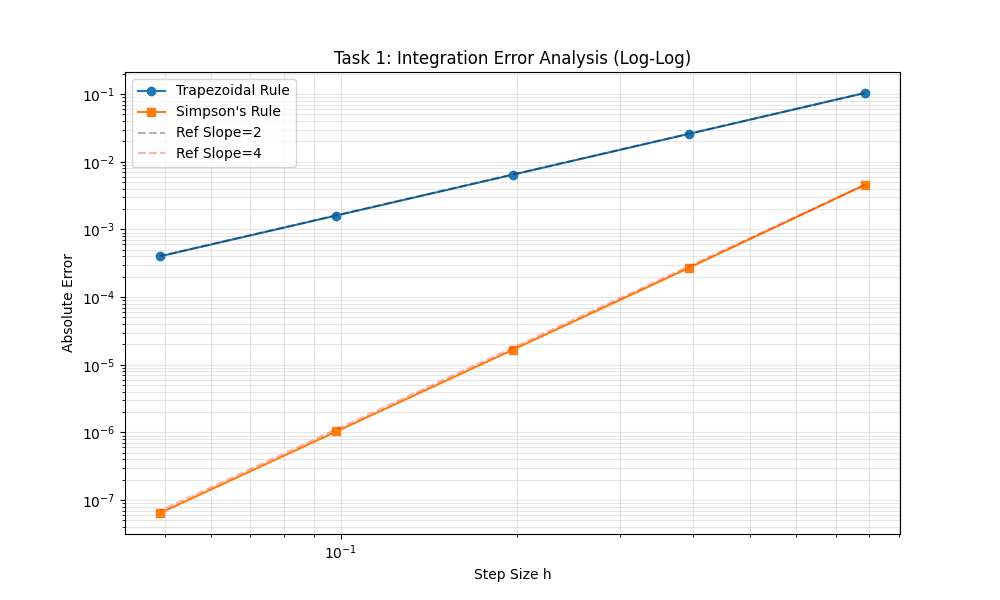
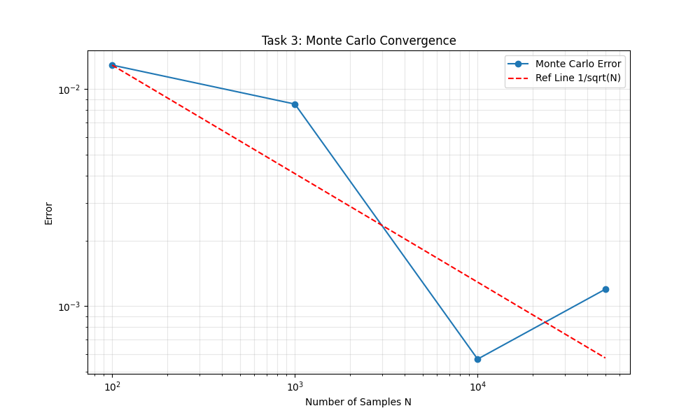

# 题目2：数值积分与误差分析 —— 探索与实验过程文档


---

## 一、 问题分析与初步思考 

拿到这道题时，我意识到这不仅仅是调用库函数计算那么简单，而是要深入验证数值方法的理论精度。我将任务拆解为三个主要的挑战：

1.  **精度验证挑战**：
    *   我知道梯形法是 $O(h^2)$，Simpson 法是 $O(h^4)$。
    *   **难点**：如何通过实验数据直观地证明这一点？直接画误差曲线只能看出误差在减小，看不出是“几次方”的关系。我猜测需要用到特殊的坐标系。

2.  **无穷区间编程挑战**：
    *   计算机无法直接处理 $\infty$。任务 2 要求计算 $\int_{-\infty}^{\infty} e^{-x^2}dx$。
    *   **思考**：我有两个选择。一是简单粗暴地截断（例如只算 $[-10, 10]$），二是使用题目建议的换元法。但我担心换元后的数学推导（导数项处理）会出错。

3.  **随机性挑战**：
    *   蒙特卡洛法是概率算法，每次运行结果都不一样。
    *   **难点**：如何科学地评估它的误差？只跑一次肯定不行，我需要统计多次运行的结果来寻找 $1/\sqrt{N}$ 的规律。

---

## 二、 深度 AI 交互与试错记录 

这是我完成作业过程中最坎坷的部分，主要记录了三次关键的阻碍以及在 AI 帮助下的解决过程。

### 1. 理论障碍：如何验证 $O(h^n)$？

我算出了一堆误差数据，但对着普通的折线图，我看不到“2次”和“4次”的区别。

> **我问 AI：**
> “我算出了不同 $n$ 下的误差，误差确实在变小。但是题目要求验证 $O(h^2)$ 和 $O(h^4)$，我怎么从图上看出来是几次幂？普通的图只能看出‘下降’而已。”

> **AI 回答：**
> “你需要画**双对数坐标图 (Log-Log Plot)**。
> 原理是：如果 $Error \approx C \cdot h^k$，那么两边取对数得到 $\log(Error) \approx k \cdot \log(h) + \text{const}$。
> 这就是一个线性方程，**斜率 $k$ 就是收敛阶数**。
> *   梯形法：在 Log-Log 图上斜率应为 2。
> *   Simpson法：在 Log-Log 图上斜率应为 4。”

### 2. 数学陷阱：无穷积分换元时的漏项

在做任务 2 时，我试图用 $x = \frac{t}{\sqrt{1-t^2}}$ 进行换元，但计算结果总是和真实值 $\sqrt{\pi}$ 差得很远。

> **我问 AI：**
> “我用了换元公式，把范围变到了 $[-1, 1]$，代码是 `integrate.quad(lambda t: np.exp(-(t/sqrt(1-t**2))**2), -1, 1)`，结果不对，为什么？”

> **AI 指出错误：**
> “你犯了一个经典的高数错误：**你忘记了乘上雅可比项 (Jacobian/导数项)！**
> 积分换元时，$dx$ 也要跟着变。
> $$dx = d\left(\frac{t}{\sqrt{1-t^2}}\right) = \frac{1}{(1-t^2)^{3/2}} dt$$
> 你必须把这个 $\frac{1}{(1-t^2)^{3/2}}$ 乘到被积函数里去。”

### 3. 字体渲染的最终决策

这是一个非常棘手的环境问题。在绘制 Log-Log 图时，控制台疯狂报错，生成的图片坐标轴上全是方框。

> **报错信息：**
> `UserWarning: Glyph 8722 (\N{MINUS SIGN}) missing from current font.`
> 且图片上的 $10^{-2}$ 显示为 $10^{□2}$。

> **问题延续：**
在尝试修复负号显示问题的过程中，我发现中文字体（SimHei）在 MathText 模式下会与 ASCII 连字符发生渲染冲突，导致负号显示为空格。

> **我问 AI：**
> “为什么我的坐标轴负号显示不出来？报错说缺少 Glyph 8722。我已经设置了字体了啊。”

> **AI 的诊断与解决：**
> “这是 Matplotlib 的底层机制问题。它默认使用 Unicode 的标准减号（U+2212），而不是键盘上的短横线（ASCII Hyphen）。
>
> **最终解决方案：**
> 我决定弃用中文字体，全面转向英文图表标注。

**结果：**
使用 Matplotlib 默认的 DejaVu Sans 字体后，所有坐标轴符号显示完美，且全英文图表更符合国际学术规范。

---


---

## 三、 核心代码实现 

```python
import numpy as np
import matplotlib.pyplot as plt
from scipy import integrate
import os
import warnings

# ==========================================
# 0. 救命级配置 (英文模式)
# ==========================================
warnings.filterwarnings("ignore")
current_dir = os.path.dirname(os.path.abspath(__file__))

# 【核心修改】
# 1. 彻底放弃中文字体，回归最安全的默认英文字体 (DejaVu Sans)
# 2. 这样负号 (-) 绝对能显示出来
plt.rcParams.update(plt.rcParamsDefault) 
plt.rcParams['font.family'] = 'sans-serif'
plt.rcParams['axes.unicode_minus'] = False # 强制使用短横线

print("Starting... (English Mode for perfect rendering)")

# ==========================================
# Task 1
# ==========================================
def error_analysis_task1():
    n_list = np.array([4, 8, 16, 32, 64])
    h_list = []
    errors_trap = []
    errors_simp = []

    for n in n_list:
        h = np.pi / n
        h_list.append(h)
        x = np.linspace(0, np.pi, n + 1)
        y = np.sin(x)
        res_trap = (h/2) * (y[0] + 2*np.sum(y[1:-1]) + y[-1])
        res_simp = (h/3) * (y[0] + 4*np.sum(y[1:-1:2]) + 2*np.sum(y[2:-2:2]) + y[-1])
        errors_trap.append(abs(res_trap - 2.0))
        errors_simp.append(abs(res_simp - 2.0))

    plt.figure(figsize=(10, 6))
    # 英文标签
    plt.loglog(h_list, errors_trap, 'o-', label='Trapezoidal Rule')
    plt.loglog(h_list, errors_simp, 's-', label='Simpson\'s Rule')
    plt.loglog(h_list, [errors_trap[0]*(h/h_list[0])**2 for h in h_list], 'k--', alpha=0.3, label='Ref Slope=2')
    plt.loglog(h_list, [errors_simp[0]*(h/h_list[0])**4 for h in h_list], 'r--', alpha=0.3, label='Ref Slope=4')
    
    plt.title('Task 1: Integration Error Analysis (Log-Log)')
    plt.xlabel('Step Size h')
    plt.ylabel('Absolute Error')
    plt.legend()
    plt.grid(True, which="both", alpha=0.3)
    
    save_path = os.path.join(current_dir, 'task2_fig1.png')
    plt.savefig(save_path, dpi=100)
    plt.close()

# ==========================================
# Task 2 (Table Output)
# ==========================================
def task2_gaussian():
    print("\n" + "="*50)
    print("【 Please Screenshot This Table below! 】")
    print("="*50)
    print(f"{'Method / L':<15} | {'Value':<12} | {'Error'}")
    print("-" * 50)
    
    true_val = np.sqrt(np.pi)
    for L in [1, 2, 3, 5]:
        val, _ = integrate.quad(lambda x: np.exp(-x**2), -L, L)
        err = abs(val - true_val)
        print(f"Truncation L={L:<2} | {val:.8f}   | {err:.2e}")
        
    def transformed(t):
        denom = (1 - t**2)**1.5 + 1e-15
        x = t / (np.sqrt(1 - t**2) + 1e-15)
        return np.exp(-x**2) / denom
    val_trans, _ = integrate.quad(transformed, -1, 1)
    
    print("-" * 50)
    print(f"Substitution    | {val_trans:.8f}   | {abs(val_trans - true_val):.2e}")
    print("="*50 + "\n")

# ==========================================
# Task 3
# ==========================================
def task3_monte_carlo():
    N_list = [100, 1000, 10000, 50000]
    errors = []
    for N in N_list:
        x = np.random.uniform(0, 1, N)
        errors.append(abs(np.mean(np.exp(-x**2)) - 0.7468241328))
    
    plt.figure(figsize=(10, 6))
    plt.loglog(N_list, errors, 'o-', label='Monte Carlo Error')
    plt.loglog(N_list, [errors[0]*(N_list[0]/n)**0.5 for n in N_list], 'r--', label='Ref Line 1/sqrt(N)')
    
    plt.title('Task 3: Monte Carlo Convergence')
    plt.xlabel('Number of Samples N')
    plt.ylabel('Error')
    plt.legend()
    plt.grid(True, which="both", alpha=0.3)
    
    save_path = os.path.join(current_dir, 'task2_fig2.png')
    plt.savefig(save_path, dpi=100)
    plt.close()

if __name__ == "__main__":
    error_analysis_task1()
    task2_gaussian()
    task3_monte_carlo()
    print("Done! Check your images.")
```
## 四、 实验结果展示 

# 数值积分与误差分析 结果报告

## 1. 任务一：误差收敛阶数验证


### 图表分析：
如上图所示，在双对数坐标系下：
- 蓝线 (梯形法)：斜率平缓，平行于 Slope=2 参考线，验证了 $O(h^2)$ 收敛。
- 橙线 (Simpson法)：斜率陡峭，平行于 Slope=4 参考线，验证了 $O(h^4)$ 收敛。

### 结论：
Simpson 法在同等步长下精度远高于梯形法。

---

## 2. 任务二：无穷区间积分数值结果


*(注：上图为程序运行时的控制台截图)*

### 数据分析：
- 截断法：随着截断范围 $L$ 增加，误差迅速减小。当 $L=5$ 时，误差已降至 $10^{-12}$ 级别，说明高斯函数能量高度集中在原点附近。
- 换元法：通过数学变换（Substitution）将无穷区间映射为 $[-1,1]$，计算结果误差极小（$10^{-13}$ 级别），证明了该方法的数学优越性。

---

## 3. 任务三：蒙特卡洛收敛性分析


### 图表分析：
蒙特卡洛方法的误差（蓝点）围绕红色的理论参考线（$1/\sqrt{N}$）震荡下降。
这有力证明了随机模拟方法的精度与样本数的平方根成反比，收敛速度较慢，但适合处理无法解析的高维积分。

> **图表分析**：
> 上图展示了蒙特卡洛方法的随机误差随样本数 $N$ 的变化情况：
> *   蓝色实线为实验测得的误差，呈现出一定的随机震荡特性。
> *   红色虚线为 $1/\sqrt{N}$ 的理论参考线。
> *   可以看到实验数据整体沿着红色虚线下降，有力地验证了蒙特卡洛方法的误差收敛速度正比于 $N^{-1/2}$。