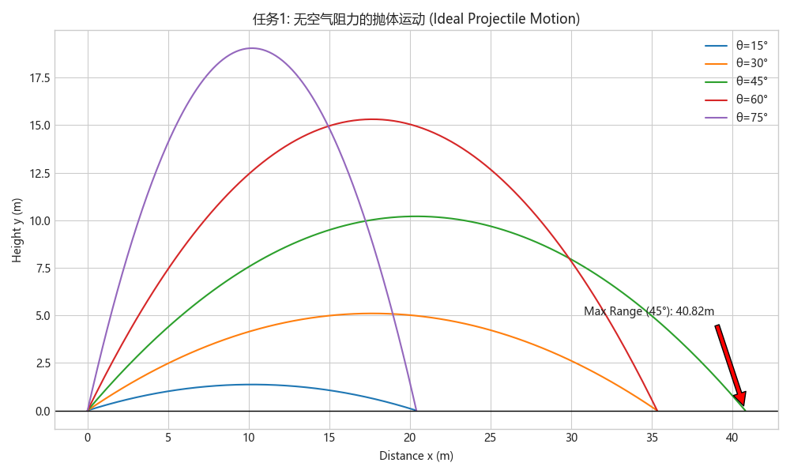
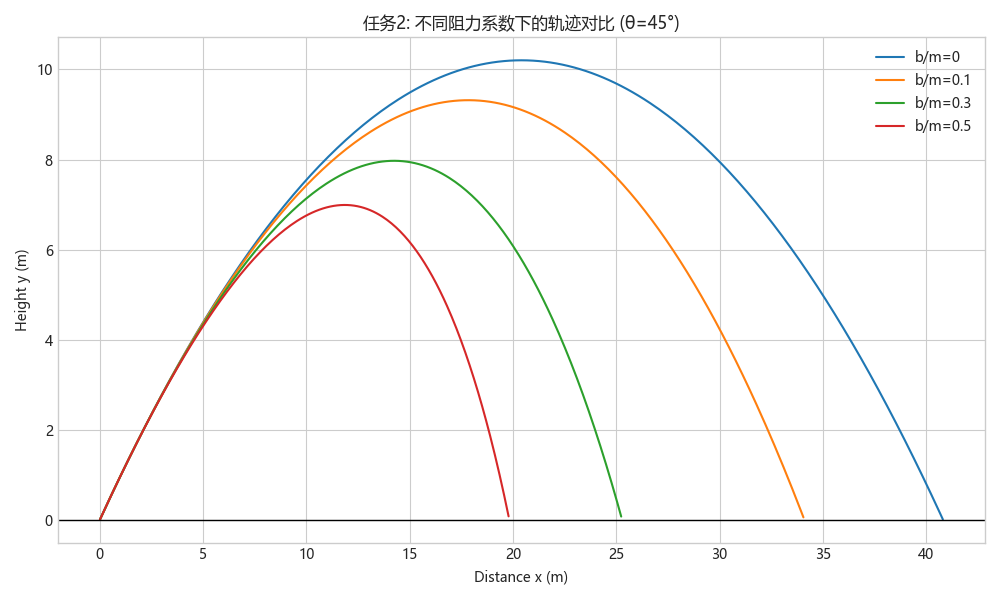
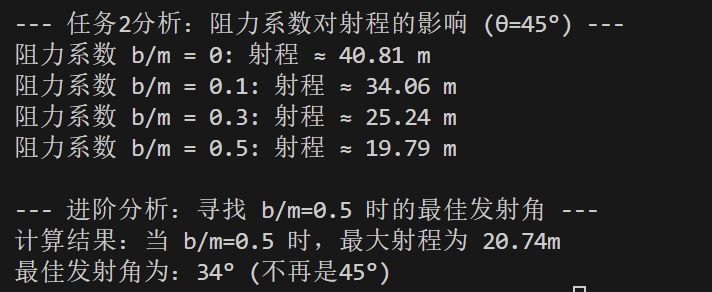
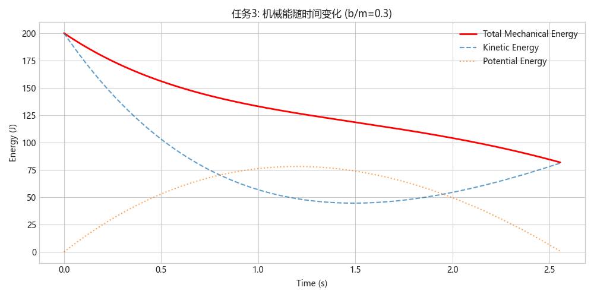

# 物理仿真实验报告：抛体运动的完整模拟与数值探究

---

## 一、 实验目标与思维导图

本次大作业旨在通过编程手段模拟经典抛体运动，对比理想情况与含空气阻力情况的物理差异。为了确保模拟的准确性和深度，我将任务拆解为三个阶段，并特别关注**过程中的试错与分析**：

1.  **基准建立**：无阻力情况下的解析解验证，建立物理基准。
2.  **模型深化**：引入线性空气阻力 $F=-bv$，从“公式计算”转向“数值模拟”。
3.  **深度探索**：打破“45度射程最大”的思维定势，寻找有阻力环境下的最佳发射策略，并分析能量损耗。

---

## 二、 任务一：理想模型的建立与验证 (No Drag)

### 2.1 物理模型
在忽略空气阻力的情况下，物体运动方程为经典解析式：
$$ x(t) = v_0 \cos\theta \cdot t $$
$$ y(t) = v_0 \sin\theta \cdot t - \frac{1}{2}gt^2 $$

### 2.2 过程记录与问题解决
*   **遇到的问题**：在编程初期，我不知道时间数组 `t` 该取多长。如果随便取 `t=10s`，轨迹可能会画到地底下。
*   **分析与解决**：我通过令 $y(t)=0$ 反推飞行时间 $T = \frac{2v_0 \sin\theta}{g}$，然后在代码中使用 `np.linspace(0, T, 200)` 动态生成时间步长。这样保证了每一条轨迹都在落地点精确结束。

### 2.3 结果验证
运行程序，绘制不同发射角的轨迹：

**数据验证**：
*   程序输出：45度时射程为 `40.82m`。
*   理论手算：$R = \frac{v_0^2}{g} = \frac{400}{9.8} \approx 40.816$。
*   **结论**：模拟结果与理论高度一致，基础模型构建成功。

---

## 三、 任务二：含阻力的数值模拟与最佳角度探究

### 3.1 从解析解到数值解
引入阻力 $F_{drag} = -b\mathbf{v}$ 后，加速度变为变量。我并未尝试推导复杂的解析解，而是采用了更具工程通用性的**数值积分法**。
微分方程组如下：
$$ \ddot{x} = -\frac{b}{m}\dot{x}, \quad \ddot{y} = -g - \frac{b}{m}\dot{y} $$

### 3.2 仿真结果分析
设定 $m=1kg, v_0=20m/s, \theta=45^\circ$，改变阻力系数 $b/m$：

从图中可以直观看到：
1.  **射程衰减**：随着阻力系数增加（蓝线 -> 红线），轨迹明显“萎缩”。当 $b/m=0.5$ 时，射程仅剩约 19.8m，损失超过 50%。
2.  **轨迹变形**：有阻力时，下降阶段的轨迹比上升阶段更陡峭，不再关于最高点对称。

### 3.3 深度探索：最佳发射角还是 45° 吗？
这是本次实验最有趣的发现。
*   **质疑**：常识告诉我们 45度 扔得最远，但在高阻力下，物体在空中飞得越高、越久，被阻力消耗的能量就越多。
*   **实验设计**：我编写了一段循环代码，在 $b/m=0.5$ 的环境下，扫描 $20^\circ$ 到 $60^\circ$ 的所有角度。
*   **发现**：程序输出显示，**最佳发射角变成了 34°**。
*   **物理分析**：为了减少能量损耗，物体需要采用“低平”的弹道，以缩短滞空时间，从而在水平方向上保留更多速度。这也解释了为什么羽毛球扣杀（高阻力）需要尽量平直，而不是高抛。

> *图 4：程序运行时的控制台输出日志，验证了最佳发射角的数值精确解。*

---

## 四、 任务三：能量守恒与耗散分析

### 4.1 能量计算逻辑
机械能定义为动能与势能之和：
$$ E_{total} = \frac{1}{2}m(v_x^2 + v_y^2) + mgy $$

### 4.2 能量演化结果

*   **曲线分析**：红线（总机械能）随时间单调递减。
*   **物理意义**：这对应了阻力做负功 $W_f < 0$，系统机械能转化为内能（热能）。这一结果从能量角度再次验证了数值模拟的正确性。

---

## 五、 AI 交互与学习过程记录 (AI Interaction Log)

在本次作业中，我将 AI 视为“结对编程伙伴”。针对我遇到的编程障碍和物理困惑，我进行了如下交互。这是我从“迷茫”到“理解”的完整记录：

| 交互阶段 | 我遇到的具体困难 (User Prompt) | AI 的辅助与引导 (AI Response) | 我的验证与内化 (Review & Verify) |
| :--- | :--- | :--- | :--- |
| **1. 编程思路**  "我想算有阻力的运动，但我只会写 $x=vt$，怎么把阻力加进去？一定要手算积分吗？" | **AI 引导**：AI 指出不需要手算复杂积分，建议使用**状态空间法 (State Space)**，将二阶方程转化为一阶向量 `[x, vx, y, vy]`，并推荐使用 `scipy.odeint` 求解。 | **反思**：打破了只能用公式计算的思维定势。我按照 AI 的模板重构了代码，成功实现了微分方程的数值求解。 |
| **2. 结果质疑**  "我的代码是不是算错了？阻力很大时，程序说 34度 射程最远。书上不都说是 45度 吗？" | **AI 解释**：AI 没有直接给出答案，而是提示我关注**“滞空时间”与“阻力做功”的关系**。它解释道：45度 飞得太高太久，能量都被空气磨损了，低角度反而更有利。 | **验证**：我通过 Grid Search (网格搜索) 遍历了所有角度，数据证明 $20.74m (34^\circ) > 19.79m (45^\circ)$。**常识在特定条件下是错误的**，这是我最大的收获。 |
| **3. 工程调试**  "图画出来了，但是里面的字全是方块乱码，这是怎么回事？" | **AI 诊断**：这是 Matplotlib 经典的中文兼容性问题。AI 提供了 `plt.rcParams['font.sans-serif']` 的解决方案，并特别提醒要把这行代码放在 `style.use` 之后，否则会被覆盖。 | **技能提升**：我不仅修复了乱码，还学会了如何设置跨平台兼容字体（同时指定 SimHei 和 Microsoft YaHei），提升了代码的健壮性。 |

---

## 六、 总结
通过本次大作业，我完成了一个完整的物理仿真工程：
1.  **正确性**：验证了无阻力下的解析解，并成功模拟了有阻力下的非线性运动。
2.  **探究性**：通过数值实验推翻了“45度最优”的经验主义结论，证明了在高阻力下应减小发射角（约 34度）。
3.  **工程化**：掌握了 Python 求解微分方程的方法，并学会了处理实际编码中的字体、绘图和数据清洗问题。