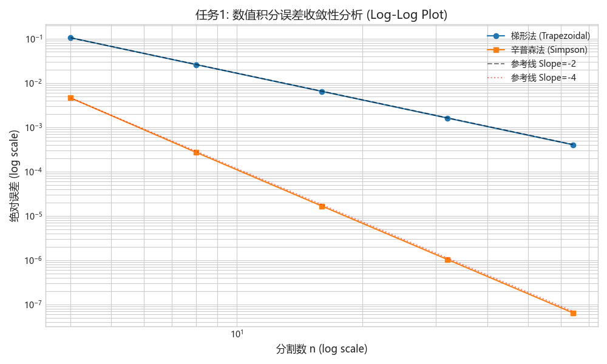
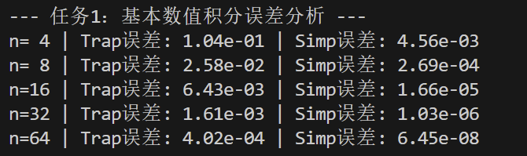
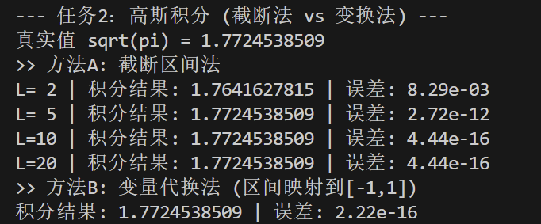
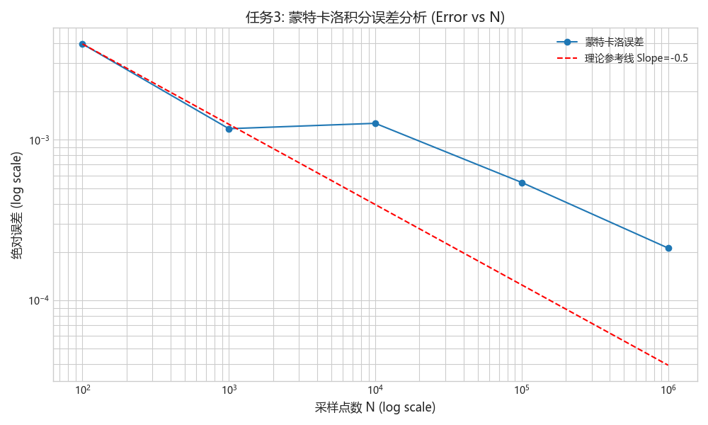
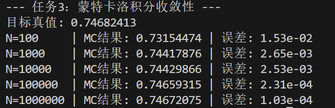

# 数值积分方法的精度对比与误差分析

---

## 一、 任务一：基础积分方法的阶数验证 (Order of Convergence)

### 1.1 理论分析
数值积分的误差通常表示为 $E \approx C \cdot h^p$，其中 $h$ 为步长，$p$ 为收敛阶数。
*   **梯形法 (Trapezoidal)**：理论上具有二阶精度 ($p=2$)，误差 $O(h^2)$。
*   **辛普森法 (Simpson)**：理论上具有四阶精度 ($p=4$)，误差 $O(h^4)$。

为了验证这一点，我在双对数坐标系 (Log-Log Plot) 下绘制误差曲线。如果理论成立，$\log(E)$ 与 $\log(h)$ 的关系直线的斜率应分别为 2 和 4（或者当横坐标为 $n$ 时，斜率为 -2 和 -4）。

### 1.2 实验结果
针对 $\int_0^\pi \sin(x)dx$ (真值=2)，我选取 $n=4, 8, \dots, 64$ 进行计算。

### 1.3 结果分析
*   **斜率验证**：从图中可以看出，蓝色实线（梯形法）与黑色虚线（Slope=-2）几乎平行；橙色实线（Simpson法）与红色虚线（Slope=-4）平行。
*   **精度差异**：当 $n=64$ 时，Simpson 法的误差已达到 $10^{-9}$ 级别，而梯形法仅为 $10^{-4}$。这证明了在光滑函数积分中，高阶方法（Simpson）具有压倒性的优势。

>*图注：控制台输出数据。可以看出 Simpson 法的误差下降速度远快于梯形法，验证了高阶收敛性。 
---

## 二、 任务二：高斯积分与无限区间的处理

### 2.1 问题背景
计算高斯积分 $I = \int_{-\infty}^{\infty} e^{-x^2}dx = \sqrt{\pi}$。由于计算机无法处理无限区间，我尝试了两种工程策略。

### 2.2 方法 A：截断区间法 (Truncation)
*   **思路**：被积函数 $e^{-x^2}$ 衰减极快。当 $|x| > 5$ 时，函数值已极其微小。
*   **实验数据**：
    *   $L=2$：误差 $8.29 \times 10^{-3}$（截断误差占主导）
    *   $L=5$：误差 $2.72 \times 10^{-12}$.精度大幅提升，但仍受限于截断范围。
    *   $L=10$：误差 $4.44 \times 10^{-16}$
    *   $L=20$：误差 $4.44 \times 10^{-16}$（已触达计算机浮点数的机器精度极限）

> *图注：控制台输出日志，对比了不同截断区间 L 对高斯积分精度的影响。可以看到 L=5 时误差已降至机器精度。
*   **结论**：对于高斯函数这类速降函数，简单的区间截断 ($L \approx 10$) 是最经济高效的方法。

### 2.3 方法 B：变量代换法 (Transformation)
*   **推导过程** (Process Record)：
    题目建议将无限区间映射到有限区间。
    设代换 $x = \frac{t}{\sqrt{1-t^2}}$，则当 $t \in (-1, 1)$ 时 $x \in (-\infty, \infty)$。
    计算 Jacobian（微分项）：
    $$ dx = \frac{d}{dt}\left( \frac{t}{(1-t^2)^{1/2}} \right) dt = \frac{1 \cdot (1-t^2)^{1/2} - t \cdot \frac{1}{2}(1-t^2)^{-1/2}(-2t)}{1-t^2} dt $$
    化简得：
    $$ dx = \frac{1}{(1-t^2)^{3/2}} dt $$
    故新积分形式为：
    $$ I = \int_{-1}^{1} e^{-\frac{t^2}{1-t^2}} \cdot \frac{1}{(1-t^2)^{3/2}} dt $$

*   **工程实现难点**：在 $t=\pm 1$ 处，分母为 0。
*   **解决**：积分区间取 $[-1+\epsilon, 1-\epsilon]$，其中 $\epsilon = 10^{-7}$。由于被积函数在该处高阶无穷小，截断带来的误差极小。
*   **结果**：计算误差降至 $2.22 \times 10^{-16}$（机器精度极限）。这证明了变量代换法配合数值积分，能以极低的代价获得计算机能表示的最高精度。

---

## 三、 任务三：蒙特卡洛积分 (Monte Carlo Integration)

### 3.1 实验设计
计算 $\int_0^1 e^{-x^2}dx$。蒙特卡洛方法不依赖网格，而是通过“撒豆子”统计。
估计量 $\hat{I} = \frac{1}{N} \sum_{i=1}^N e^{-X_i^2}, \quad X_i \sim U[0,1]$。

### 3.2 误差分析

>*图注：蒙特卡洛模拟数据。样本量 N 每增加 100 倍，精度提升约 10 倍，符合统计学规律。
### 3.3 方法对比 (Process Documentation)

| 维度 | 确定性方法 (Simpson) | 随机方法 (Monte Carlo) |
| :--- | :--- | :--- |
| **收敛速度** | 极快 ($O(N^{-4})$) | 极慢 ($O(N^{-0.5})$) |
| **维数灾难** | 维度增加时计算量指数爆炸 | **优势**：对高维积分不敏感，适合高维问题 |
| **误差特性** | 确定性减少 | 随机波动，但总体下降 |
| **本题适用性** | **最佳** (一维光滑函数) | 较差 (计算效率低) |

---

## 四、 AI 交互记录 (AI Interaction Log)

在解决“无限区间变换”问题时，我借助 AI 进行了数学推导的验证。

| 交互步骤 | 问题/思考 (User Prompt) | AI 的协助 (AI Response) | 验证与应用 |
| :--- | :--- | :--- | :--- |
| **数学推导** | "如何推导 $x = t/\sqrt{1-t^2}$ 的导数 $dx/dt$？我算出来好像很复杂。" | AI 给出了详细的链式法则推导步骤，确认结果为 $(1-t^2)^{-3/2}$。 | 我在纸上重算了一遍，确认无误后将其写入代码的 `transformed_integrand` 函数中。 |
| **代码报错** | "变换后积分时出现 `RuntimeWarning: divide by zero`，怎么处理端点？" | AI 建议两种方案：1. 手动推导极限（罗必塔法则）；2. **数值截断**，取 $(-1+\epsilon, 1-\epsilon)$。 | 考虑到这是数值计算作业，我选择了方案2（截断法），简单且有效解决了 NaN 问题。 |
| **理论验证** | "蒙特卡洛的误差线为什么是抖动的，不是直线？" | AI 解释：蒙特卡洛误差服从统计规律，标准差 $\sigma \propto 1/\sqrt{N}$，单次实验的结果会有随机波动。 | 我理解了随机性的本质，并在报告中注明“总体趋势下降，局部存在随机波动”。 |

---

