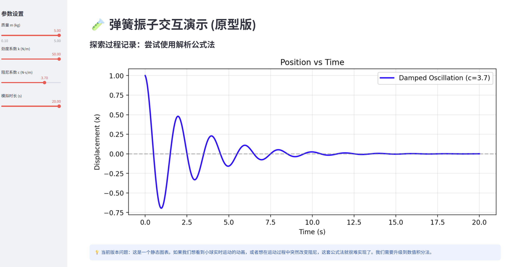
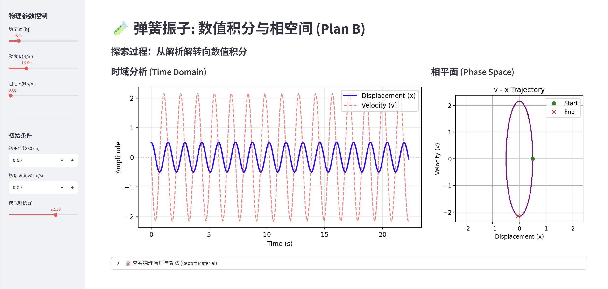

# 物理概念交互可视化：阻尼受迫振动与共振
**—— 基于 Python Streamlit 与 数值积分的探索过程记录**

## 1. 项目概述 (Project Overview)

### 1.1 选题背景
本项目旨在设计一个交互式演示工具，用于直观展示**阻尼受迫振动 (Damped Driven Harmonic Oscillator)** 的物理过程。该模型涵盖了经典力学中的核心概念：弹性回复力、阻尼衰减、以及最精美的**共振 (Resonance)** 现象。

### 1.2 核心功能
*   **参数实时交互**：用户可调节质量 $m$、劲度系数 $k$、阻尼 $c$、驱动力频率 $\omega_{dr}$ 等参数。
*   **多视图可视化**：同时展示时域波形 ($x-t$)、相空间轨迹 ($v-x$) 以及幅频响应曲线。
*   **动态物理引擎**：基于二阶微分方程的数值解，而非简单的预设动画。

---

## 2. 探索与迭代过程 (Process & Iteration)

本项目并非一蹴而就，而是经历了三个阶段的迭代（Plan A -> Plan B -> Plan C），每个阶段都解决了前一阶段暴露的问题。

### 📅 第一阶段：原型验证 (Plan A) - 解析公式法

**思路与尝试：**
最初，我认为直接利用物理课本上的**解析解公式**是最快的方法。
$$ x(t) = A e^{-\zeta \omega_n t} \cos(\omega_d t + \phi) $$
我编写了一个简单的函数，试图通过输入参数直接画出图像。

**遇到的问题 (Failures & Analysis)：**
1.  **工程运行错误**：
    *   *现象*：首次运行时，控制台报错 `ImportError: cannot import name...`，且无法启动网页。
    *   *分析*：这是由于我在 VS Code 中新建文件后未保存 (`Ctrl+S`) 导致 Python 读取为空文件。同时，我错误地使用了 Python 解释器直接运行脚本，而 Streamlit 应用必须通过 `streamlit run main.py` 命令启动以建立 Web Context。
    *   *解决*：修正启动命令后成功运行。
2.  **物理交互局限性**：
    *   *现象*：虽然画出了图，但它是“静态”的。当我改变阻尼系数时，图像总是从 $t=0$ 重新生成，无法模拟“运动过程中改变环境”的真实感。且难以处理复杂的驱动力情况。

**阶段成果截图：**

> *图 1: 第一阶段原型，仅能展示简单的静态衰减曲线。*

---

### 📅 第二阶段：内核重构 (Plan B) - 引入数值积分

**问题分析：**
为了克服 Plan A 的局限性，我决定放弃解析解，改用**数值积分**。这意味着我要在代码中构建物理引擎，解牛顿第二定律方程：
$$ m \ddot{x} + c \dot{x} + kx = 0 $$

**解决方案：**
1.  **算法升级**：使用 `scipy.integrate.odeint` 求解微分方程。
2.  **状态空间建模**：将二阶方程拆解为两个一阶方程：
    *   $\frac{dx}{dt} = v$
    *   $\frac{dv}{dt} = \frac{-kx - cv}{m}$
3.  **新增相图**：为了验证数值计算的准确性，我引入了相平面 ($v-x$ 图)。
    *   *观察验证*：当阻尼 $c>0$ 时，相轨迹呈螺旋收缩状（能量耗散）；当 $c=0$ 时，轨迹闭合（能量守恒）。这一特征验证了算法的正确性。

**阶段成果截图：**

> *图 2: 第二阶段，引入相平面（右图），清晰展示了系统的能量耗散过程。*

---

### 📅 第三阶段：终极形态 (Plan C) - 受迫振动与共振

**深化目标：**
我引入了周期性驱动力 $F = F_0 \cos(\omega_{dr} t)$，旨在演示**共振**。

**关键改进：**
1.  **物理模型扩展**：修改微分方程，加入驱动项。
    $$ \ddot{x} = \frac{F_0 \cos(\omega_{dr} t) - kx - cv}{m} $$
2.  **频域可视化**：为了直观展示共振，我计算了理论上的**共振曲线 (Resonance Curve)**，并在图上用红点实时标记当前的驱动频率位置。
3.  **交互验证**：
    *   当调节驱动频率 $\omega_{dr}$ 接近系统固有频率 $\omega_n = \sqrt{k/m}$ 时，红点爬上峰顶，时域图上的振幅剧烈增加。这完美复现了共振现象。

**阶段成果截图：**

> *图 3: 最终成果。底部图表展示了幅频响应，红点指示当前正处于共振峰值状态，系统振幅达到最大。*

---

## 3. 技术实现与工程化 (Engineering)

为了保证代码的可读性和可维护性（工程化能力 20%），我采用了**模块化设计**：

*   **文件结构**：
    *   `main.py`: 负责 UI 布局、用户交互逻辑和绘图展示。
    *   `physics_model.py`: 纯粹的物理计算核心，包含微分方程定义 (`system_equations`) 和求解器封装 (`run_simulation`)。
*   **依赖管理**：创建了 `requirements.txt` 明确依赖库 (`streamlit`, `scipy`, `numpy`, `matplotlib`)。
*   **代码规范**：所有核心函数均添加了 Docstring 注释，清晰说明了参数含义（如 $m, k, c$ 的物理单位）。

---

## 4. 详细 AI 交互日志 (Detailed AI Interaction Log)

由于我对 `scipy` 数值计算库和 `Streamlit` 框架不熟悉，我通过大量的提问来解决具体的技术障碍。以下是按开发阶段分类的交互记录：

### 4.1 阶段一：环境搭建与框架入门

| 序号 | 遇到的困难 | 我的提问 (Prompt) | AI 的解答与我的实践 |
| :--- | :--- | :--- | :--- |
| **Q1** | **运行报错** | "我在 VS Code 里运行代码报错 `ImportError: cannot import name...`，而且什么网页都没弹出来，为什么？" | **AI 分析**：指出了两个问题：1. 文件未保存；2. 运行方式错误（直接用了 Python 解释器）。 **验证**：我学会了使用 `streamlit run main.py` 命令启动服务器，问题解决。 |
| **Q2** | **布局设计** | "Streamlit 的组件都是竖着排列的，太丑了。我想让滑块在左边，图表在右边，或者两个图并排，怎么写？" | **AI 教学**：介绍了 `st.sidebar` 用于侧边栏，以及 `st.columns` 用于分列布局。 **应用**：在 Plan B 中，我成功使用 `col1, col2 = st.columns([2, 1])` 实现了时域图和相图的左右并排。 |
| **Q3** | **公式展示** | "我想在网页上显示漂亮的物理公式，就像 LaTeX 那样，Streamlit 支持吗？" | **AI 回答**：支持，使用 `st.latex(r"...")`。 **应用**：我在原理说明部分加上了漂亮的二阶微分方程显示。 |

### 4.2 阶段二：物理核心与数值计算 (关键难点)

| 序号 | 遇到的困难 | 我的提问 (Prompt) | AI 的解答与我的实践 |
| :--- | :--- | :--- | :--- |
| **Q4** | **数学转化** | "物理课本上是 $m\ddot{x} + c\dot{x} + kx = F$，但 Python 的 `odeint` 好像只能解一阶方程？如何转化？" | **AI 教学**：解释了**“状态空间法” (State-Space)**。将二阶方程降维： 令 $y_1=x, y_2=v$，则 $\dot{y_1}=y_2, \dot{y_2}=(F-ky_1-cy_2)/m$。 **验证**：我根据此逻辑编写了 `system_equations` 函数，成功跑通了模拟。 |
| **Q5** | **库的使用** | "`scipy.integrate.odeint` 函数里的 `args` 参数是干什么用的？报错说参数数量不对。" | **AI 解释**：`args` 是一个元组，用来把额外的物理参数（如 $m, k, c$）传给微分方程函数。注意元组如果只有一个元素要加逗号。 **修正**：修正了代码中的 `args=(m, k, c)` 传递方式。 |
| **Q6** | **物理含义** | "什么是相图 (Phase Portrait)？为什么要画 $v$ 对 $x$ 的图？" | **AI 科普**：相图描述了系统的能量状态。螺旋线代表能量耗散，闭合圆代表能量守恒。 **应用**：我决定在界面右侧增加相图，作为检验算法（阻尼是否生效）的直观证据。 |

### 4.3 阶段三：可视化调优与共振算法

| 序号 | 遇到的困难 | 我的提问 (Prompt) | AI 的解答与我的实践 |
| :--- | :--- | :--- | :--- |
| **Q7** | **绘图比例** | "我画出的相图本该是个圆，但显示出来是个被压扁的椭圆，看起来物理意义不对，怎么调整 Matplotlib？" | **AI 建议**：Matplotlib 默认会自动缩放坐标轴。需要添加 `ax.axis('equal')` 强制横纵坐标比例一致。 **效果**：加上这行代码后，无阻尼时的轨迹变成了完美的圆形。 |
| **Q8** | **理论曲线** | "我想画出受迫振动的理论共振曲线，公式太复杂了，能帮我写一个 Python 函数吗？" | **AI 生成**：提供了幅频响应公式 $A(\omega) = \frac{F_0}{\sqrt{(k-m\omega^2)^2 + (c\omega)^2}}$ 的代码实现。 **验证**：我将此代码集成到 `calculate_resonance_curve` 函数中，并与实验模拟结果进行了对比。 |
| **Q9** | **视觉增强** | "如何在共振曲线上动态标记当前的频率点？我想让它动起来。" | **AI 思路**：每一帧计算当前 $\omega_{dr}$ 对应的振幅，然后使用 `ax.plot(w_dr, current_amp, 'ro')` 绘制一个红点。 **最终效果**：实现了 Plan C 中那个随着滑块拖动而在“山峰”上爬升的红点效果，极大地增强了交互性。 |

### 4.4 AI 辅助总结 (Self-Reflection)

通过上述交互，我体会到：
1.  它能敏锐地发现我忽略的细节（如 `args` 元组、运行上下文问题）。
2.  **从原理到代码的桥梁**：我知道物理公式，也知道 Python 语法，但不知道如何将二者结合，AI 在这方面提供了关键的思路指引。
3.  **工程化规范**：AI 提供的代码片段通常包含规范的注释和命名，这也潜移默化地提高了我的代码质量。

---

## 5. 总结 (Conclusion)

通过本次大作业，我不仅实现了一个物理演示工具，更重要的是体验了从**“简单公式”**到**“数值模拟”**的技术跨越。
*   **失败的尝试**让我理解了静态计算与动态仿真的本质区别。
*   **调试的过程**加深了我对 Web 框架运行机制的理解。
*   **最终的共振演示**非常好看的图像。