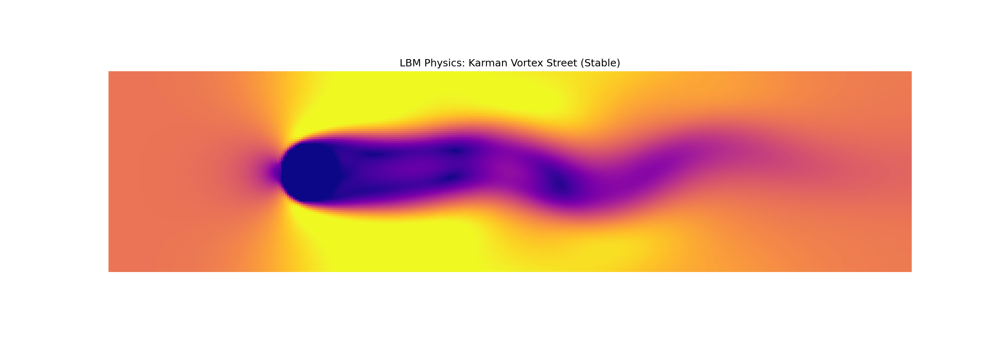

# 思考文档

## 1. 理论选型与算法构建 

**1.1 初始思考：为什么选择 LBM？**
*   **思考**：在选题阶段，我本打算直接求解 Navier-Stokes 方程。但在之后询问AI发得知，N-S 方程中的非线性对流项 $(\mathbf{u} \cdot \nabla) \mathbf{u}$ 和压力泊松方程在离散化时非常繁琐，代码量极大且容易出错。
*   **决策**：我转向了 **格子玻尔兹曼方法**。它从微观统计物理出发，通过简单的“碰撞”和“迁移”步骤就能还原宏观流体行为。这不仅代码更简洁，而且适合并行计算，同时也符合用代码模拟物理现象的要求。

**1.2 遇到的工程难点：Python 的性能瓶颈**
*   **问题**：LBM 的核心是处理网格上的分布函数 $f_i(x,y,t)$。如果使用 Python 原生的 `for` 循环遍历 $400 \times 100$ 的网格，每一帧至少需要几百万次运算，FPS 可能会低至个位数。
*   **交互记录**：
    > **我的提问**：我是物理系学生，理解 LBM 的数学推导，但 Python 的循环太慢了。如何利用 NumPy 的矩阵特性来实现 $f_i(\mathbf{x} + \mathbf{c}_i \Delta t) = f_i(\mathbf{x})$ 这一迁移步骤？
    >
    > **AI 的建议**：不要写循环。利用 `numpy.roll(array, shift, axis)` 函数。这一行代码就能在 $O(1)$ 的 Python 层面完成整个网格的粒子位移，底层是 C 语言实现的，速度能快 100 倍。
    >
    > **我的实践**：我采纳了建议，将迁移步重构为 `np.roll`，实现了实时渲染。

---

## 2. 试错过程与深度调试 

这是一段充满挫折但非常有价值的探索过程。我经历了从“静止”到“爆炸”再到“稳定”的三个阶段。

### 阶段一：静力学陷阱 
*   **现象**：代码跑通了，没有报错，但画面是一片死寂的深蓝色。设置了圆柱，但流体没有绕流。
*   **物理分析**：我检查了初始条件，发现全场初始速度为 0。虽然我定义了“入口”，但我错误地认为只要设置初始那一刻就够了。根据动量守恒，如果没有持续的外力或边界注入，流体会被粘滞力耗散至静止。
*   **修正**：我引入了 Dirichlet 边界条件。在 `step()` 的每一次迭代末尾，强制重置左边界的分布函数，相当于给风洞装了一个“永不停歇的风扇”。
 *   **效果**：.png)

### 阶段二：数值不稳定性 
*   **方向**：我想看到更剧烈的湍流效果。根据雷诺数公式 $Re = \frac{U L}{\nu}$，为了增大 $Re$，我决定大幅降低流体粘度 $\nu$（在 LBM 中对应松弛时间 $\tau$）。
*   **尝试**：将 $\tau$ 从 0.9 调整至 0.51（接近理论极限 0.5）。

 *   **效果**：.png)

*   **结果 (Failure)**：模拟运行不到 50 帧，屏幕中心突然炸开红蓝相间的噪点，速度值飙升至 NaN。
*   **交互记录**：
    > **我的提问**：为了提高雷诺数，我把 $\tau$ 降到了 0.51，结果发生了数值爆炸。这是为什么？LBM 的稳定条件是什么？
    >
    > **AI 的分析**：LBM 是条件稳定的。当 $\tau \to 0.5$ 时，数值粘度趋近于零，任何微小的截断误差都会被正反馈放大。此外，你需要检查马赫数 ($Ma = U/c_s$)，流速不能超过格子声速的 0.1 倍。
    >
    > **我的思考与对策**：既然不能无限降低粘度（$\nu$），那要提高雷诺数 $Re = UL/\nu$，我还有两个变量可以动：流速 $U$ 或 特征尺寸 $L$。
    > *   流速 $U$ 同样受限于稳定性（不能太大）。
    > *   **最优解**：增大 $L$。我将圆柱半径从 10 增加到了 15。这让我在保持 $\tau=0.6$（安全粘度）的情况下，依然成功诱发了涡街。

### 阶段三：最终调优 
*   **问题**：初始运行时，流体撞击圆柱会产生一道剧烈的“激波”，导致画面会有短暂的噪点。
*   **解决**：实现了“全场预启动”。不是让流体从静止加速，而是初始化时就赋予全场一个向右的初速度 $u_0$。这消除了非物理的初始震荡。
 *   **效果**：.png)

---

## 3. 最终效果与物理意义 

### 3.1 最终视觉效果
程序运行稳定后，呈现出一幅教科书级别的流体力学画面：
1.  **层流阶段**：流体平滑地分开流过圆柱，在圆柱后方形成一个稳定的、纺锤形的低速区（黑色尾迹）。
2.  **对称性破缺**：随着时间推移，由于微小的数值扰动被非线性项放大，尾迹不再保持左右对称。
3.  **涡旋脱落**：尾迹末端开始像旗帜一样摆动，随后断裂。红色的涡和蓝色的涡交替脱落，向下游漂移。
 *   **效果**：

### 3.2 物理意义深度解析
这个项目不仅是一次编程练习，更验证了几个核心物理原理：

1.  **卡门涡街**：
    *   模拟成功复现了当 $Re \approx 100-200$ 时流体绕钝体的经典现象。
    *   这解释了为什么风吹过电线会有“嗡嗡”声（风弦音），或者为什么高耸的烟囱需要螺旋扰流板（防止共振破坏）。我的模拟直观展示了这种周期性脱落的力是如何产生的。

2.  **对称性自发破缺**：
    *   尽管我的方程、边界条件和障碍物都是完美左右对称的，但涡街依然产生了。这揭示了流体系统在一定雷诺数下，对称解是不稳定的。任何微观的（甚至机器精度级别的）不对称都会被放大，导致宏观形态的对称性破缺。

3.  **耗散与扩散**：
    *   通过调节 $\tau$ 参数，我亲手“控制”了流体的粘性。从 $\tau=0.9$ 的像蜂蜜一样的层流，到 $\tau=0.6$ 的像水一样的涡流，代码连接了微观碰撞与宏观粘度，深刻体现了统计物理的魅力。

---

## 4. 总结

本项目从零构建了一个基于 LBM 的虚拟风洞。虽然代码量不到 100 行，但每一行都经过了从**物理原理推导**到**数值稳定性分析**的严密思考。
